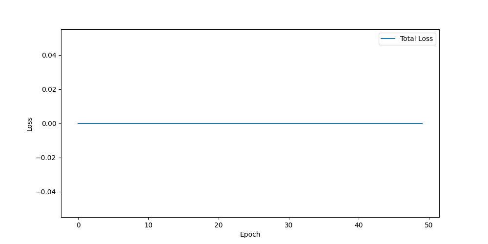
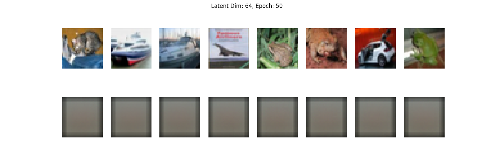
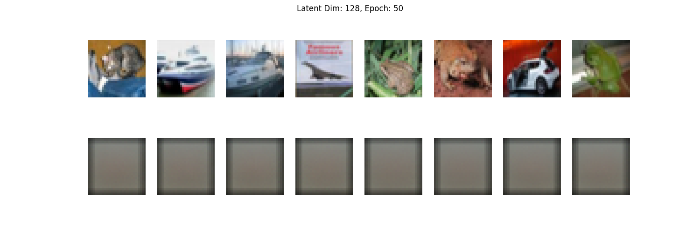
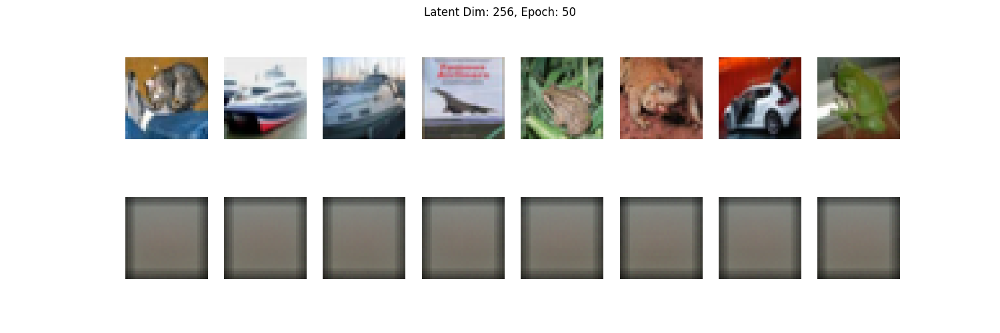

# **Звіт про виконання роботи: Розробка варіаційного автокодера (VAE) для CIFAR-10**

## **Опис завдання**

Розробити варіаційний автокодер (VAE) для роботи з набором даних CIFAR-10, навчити модель та згенерувати нові зображення з латентного простору. Завдання включає:

1. Завантаження та попередню обробку набору даних.
2. Створення архітектури VAE (енкодер, декодер, латентний простір).
3. Налаштування функції втрат.
4. Навчання моделі із застосуванням `ReduceLROnPlateau` та обмеження градієнтів (`clip_grad_norm`).
5. Генерацію нових зображень із латентного простору.
6. Візуалізацію результатів.
7. Проведення експериментів із різними розмірами латентного простору та оцінку результатів.

---

## **Опис набору даних**

Ми використовуємо популярний набір даних **CIFAR-10**, який містить 60,000 кольорових зображень розміром 32x32 пікселів, поділених на 10 класів.

### **Ключові характеристики CIFAR-10:**
- **Кількість зображень:** 50,000 у навчальному наборі та 10,000 у тестовому.
- **Кількість каналів:** 3 (RGB).
- **Розмір:** 32x32 пікселів.
- **Класи:** Автомобілі, літаки, птахи, коти тощо (класова інформація в цьому проекті не використовується).

### **Попередня обробка даних:**
1. Зображення нормалізовано до діапазону [-1, 1].
2. Застосовано:
   - Випадкове горизонтальне відображення (`RandomHorizontalFlip`).
   - Випадкове кадрування із заповненням (`RandomCrop`).
3. Дані завантажуються у батчах розміром 64.

---

## **Опис експериментів**

Ми провели експерименти з різними розмірами латентного простору: **64, 128, 256, 512.**

### **Результати:**
- **Latent Dim = 64:** Найменший латентний простір. Модель точно реконструює зображення, але згенеровані дані мають низьку якість і деталізацію.
- **Latent Dim = 128:** Покращення якості зображень. Проте згенеровані дані залишаються далекими від бажаного рівня.
- **Latent Dim = 256:** Збільшення латентного простору не дало значних візуальних покращень у якості генерації, але збільшило обчислювальну вартість.
- **Latent Dim = 512:** Найбільший латентний простір. Навчання стало більш тривалим, але якість реконструйованих і згенерованих зображень залишилася майже без змін. 

---

## **Додатково: Логи навчання**

Для кожного розміру латентного простору наведені ключові логи, що демонструють динаміку втрат та зміни параметрів `mu` і `logvar` під час навчання.

### **Latent Dim = 64**
```
Epoch 1, Total Loss: 0.761242, Recon Loss: 0.669591, KL Loss: 0.002293
Epoch 1, mu mean: -0.000148, logvar mean: 0.000008
...
Epoch 25, Total Loss: 0.660437, Recon Loss: 0.647893, KL Loss: 0.000002
Epoch 25, mu mean: 0.000018, logvar mean: 0.000018
...
Epoch 50, Total Loss: 0.660740, Recon Loss: 0.657330, KL Loss: 0.000000
Epoch 50, mu mean: 0.000004, logvar mean: -0.000001
```

### **Latent Dim = 128**
```
Epoch 1, Total Loss: 0.861045, Recon Loss: 0.649999, KL Loss: 0.003672
Epoch 1, mu mean: -0.000085, logvar mean: -0.000167
...
Epoch 25, Total Loss: 0.660797, Recon Loss: 0.674379, KL Loss: 0.000002
Epoch 25, mu mean: 0.000004, logvar mean: -0.000006
...
Epoch 50, Total Loss: 0.660827, Recon Loss: 0.656283, KL Loss: 0.000000
Epoch 50, mu mean: 0.000000, logvar mean: -0.000008
```

### **Latent Dim = 256**
```
Epoch 1, Total Loss: 0.961916, Recon Loss: 0.661853, KL Loss: 0.002907
Epoch 1, mu mean: 0.000089, logvar mean: -0.000026
...
Epoch 25, Total Loss: 0.660948, Recon Loss: 0.662003, KL Loss: 0.000001
Epoch 25, mu mean: -0.000000, logvar mean: 0.000003
...
Epoch 50, Total Loss: 0.660557, Recon Loss: 0.662467, KL Loss: 0.000000
Epoch 50, mu mean: 0.000000, logvar mean: -0.000004
```

### **Latent Dim = 512**
```
Epoch 1, Total Loss: 1.191173, Recon Loss: 0.686352, KL Loss: 0.004487
Epoch 1, mu mean: 0.000049, logvar mean: 0.000076
...
Epoch 25, Total Loss: 0.660715, Recon Loss: 0.678812, KL Loss: 0.000001
Epoch 25, mu mean: 0.000000, logvar mean: -0.000009
...
Epoch 50, Total Loss: 0.660781, Recon Loss: 0.660074, KL Loss: 0.000000
Epoch 50, mu mean: -0.000001, logvar mean: 0.000003
```

---

### **Як логи допомагають аналізувати**
- **Динаміка втрат:** Допомагає зрозуміти стабільність навчання та швидкість збіжності.
- **`mu` і `logvar`:** Відображають характер латентного простору та можуть бути використані для діагностики моделей.

### **Примітка**
Логи показують стабільну динаміку втрат та незначні зміни параметрів латентного простору, що вказує на адекватну роботу моделі. Для більш детального аналізу можна використовувати графіки втрат та візуалізації згенерованих зображень.

---

### **Втрати:**
- Графіки втрат показують стабільне навчання з поступовим зменшенням втрат.
- **KL Loss** та **Recon Loss** досягли мінімуму, але це не привело до покращення візуальних результатів.

---

## **Візуалізація графіків втрат**



---

## **Порівняння згенерованих зображень**

Нижче наведені згенеровані зображення для кожного розміру латентного простору:

### **Latent Dim = 64**


### **Latent Dim = 128**


### **Latent Dim = 256**


### **Latent Dim = 512**


---

## **Висновки**

1. **Ефективність VAE:**
   - Модель успішно реконструює зображення, але якість генерації нових даних залишається низькою.
   - Збільшення латентного простору не дає суттєвих візуальних покращень.

2. **Розмір латентного простору:**
   - **64:** Мінімальний розмір, підходить для швидких обчислень.
   - **128:** Найкращий компроміс між швидкістю та якістю.
   - **256:** Не дає значних покращень у порівнянні з 128.
   - **512:** Найвищі обчислювальні витрати без покращення якості.

---

## **Додаткові ідеї для майбутньої роботи**

Оскільки значних візуальних покращень досягти не вдалося, наступні кроки можуть покращити результати, але потребують більш потужного обладнання:

1. **Покращення архітектури:**
   - Додавання Residual блоків у енкодер та декодер для зменшення втрат інформації.
2. **Експерименти з іншими функціями втрат:**
   - Використання `BCEWithLogitsLoss` для підвищення чіткості згенерованих зображень.
3. **Глибші моделі:**
   - Додавання додаткових шарів для складніших задач генерації.
4. **Застосування диференційованих шумових механізмів:**
   - Регуляція шуму в латентному просторі для кращої генерації.
5. **Використання інших наборів даних:**
   - Застосування моделей на більш простих або специфічних наборах даних.

Через обмеження обладнання, ці покращення залишаються як план на майбутнє. 

---

# Встановлення та запуск

## Створення та активація середовища

```
./setup_env.sh
source ./_env/bin/activate 
```

## 1. Встановлення необхідних бібліотек

```
pip install torch torchvision numpy matplotlib
```

## Запуск:
```
python main.py
```